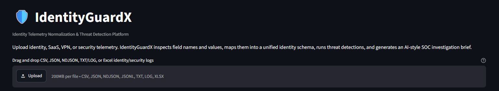
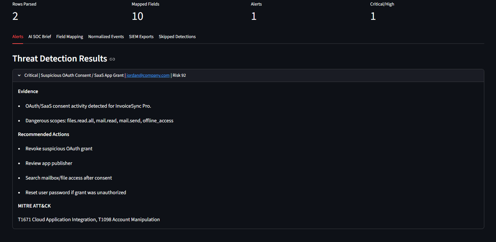
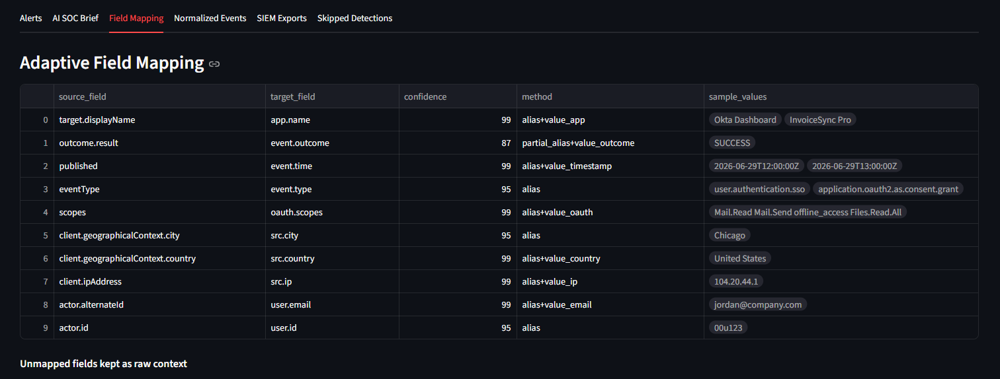
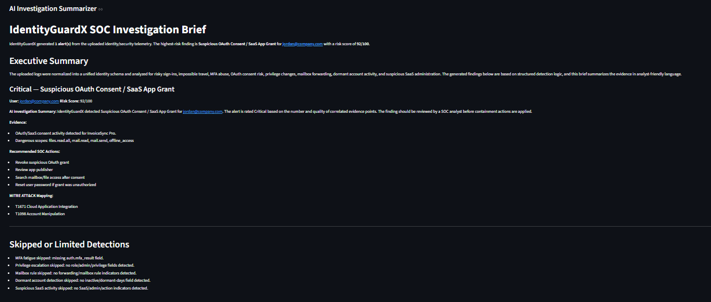
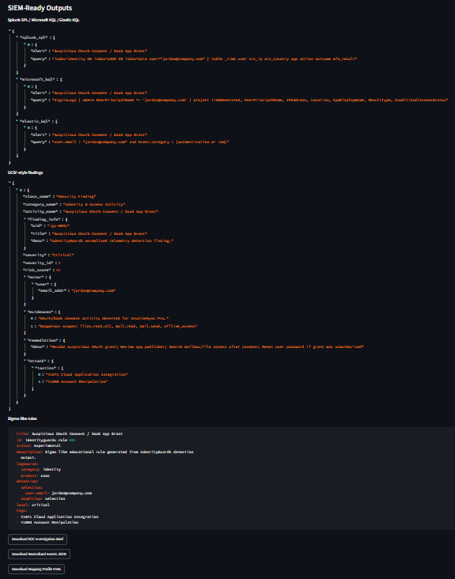

# 🛡️ IdentityGuardX

**Identity Telemetry Normalization & Threat Detection Platform**

IdentityGuardX is a SOC-focused identity security platform that accepts identity, SaaS, VPN, and audit telemetry from different log formats, normalizes the data into a unified identity schema, runs threat detections, scores risk, and generates analyst-ready investigation output.

Unlike a fixed parser that only works with one vendor file, IdentityGuardX includes an **adaptive log normalization engine**. It inspects both **field names** and **sample values** to map custom logs into a common schema before running detections.

---

## 🚀 Project Highlights

- Drag-and-drop telemetry upload dashboard
- CSV, JSON, NDJSON/JSONL, TXT/LOG, and XLSX support
- Adaptive field-name mapping
- Value-based inference for meaningful headerless logs
- Unified identity event schema
- Identity threat detection engine
- Risk scoring and severity classification
- AI-style SOC investigation brief generator
- MITRE ATT&CK mapping for generated alerts
- SIEM-ready exports: Splunk SPL, Microsoft KQL, Elastic KQL
- OCSF-style JSON findings
- Sigma-like detection rules
- FastAPI backend endpoint for file analysis
- CLI pipeline runner for repeatable testing
- Docker support

---

## 📸 Screenshots

> Save your screenshots inside the `screenshots/` folder using the exact names below. GitHub will automatically render them in this README.

### 1. Dashboard and Drag-and-Drop Upload



The main dashboard allows analysts to upload identity/security logs using a drag-and-drop interface. The sidebar explains the project flow from file upload to SIEM-ready exports.

### 2. Threat Detection Results



The Alerts tab shows generated detections with severity, risk score, affected user, evidence, recommended actions, and MITRE ATT&CK mapping.

### 3. Adaptive Field Mapping



The Field Mapping tab shows how IdentityGuardX converts vendor-specific or custom fields into normalized schema fields such as `user.email`, `src.ip`, `src.country`, `app.name`, and `event.outcome`.

### 4. AI SOC Investigation Brief



The AI SOC Brief tab converts structured detection output into an analyst-friendly investigation summary with evidence, risk explanation, and response steps.

### 5. SIEM Exports



The SIEM Exports tab provides Splunk SPL, Microsoft KQL, Elastic KQL, OCSF-style JSON, and Sigma-like rule output for SOC workflows.

---

## 🧠 Why This Project Matters

Modern identity attacks often do not start with malware. They start with compromised accounts, risky sign-ins, MFA abuse, OAuth consent phishing, suspicious SaaS activity, or unauthorized privilege changes.

In real SOC environments, logs come from many sources and often use different field names for the same concept. For example:

| Concept | Microsoft Entra ID | Okta | Google Workspace | IdentityGuardX Normalized Field |
|---|---|---|---|---|
| User | `userPrincipalName` | `actor.alternateId` | `actor.email` | `user.email` |
| IP address | `ipAddress` | `client.ipAddress` | `ipAddress` | `src.ip` |
| Country | `location.countryOrRegion` | `client.geographicalContext.country` | `geo.country` | `src.country` |
| Application | `appDisplayName` | `target.displayName` | `applicationName` | `app.name` |
| Result | `status.errorCode` | `outcome.result` | `event.type` | `event.outcome` |

IdentityGuardX solves this by normalizing different log sources before running detections.

---

## 🏗️ Architecture

```text
CSV / JSON / NDJSON / TXT / LOG / XLSX
        ↓
Source and File Type Detector
        ↓
Field + Value Analyzer
        ↓
Adaptive Field Mapper
        ↓
Normalized Identity Schema
        ↓
Threat Detection Engine
        ↓
Risk Scoring + Severity Classification
        ↓
AI-Style SOC Investigation Summarizer
        ↓
SOC Dashboard + SIEM-Ready Exports
```

---

## 🔄 Adaptive Log Normalization

IdentityGuardX is not limited to one predefined file format.

It can handle:

- Known vendor fields such as `userPrincipalName`, `ipAddress`, `appDisplayName`, and `outcome.result`
- Custom field names such as `account`, `source_address`, `geo_location`, `service_name`, and `auth_status`
- Headerless CSV or Excel files when the values are meaningful
- TXT/LOG files with key-value style records

### Example: Custom CSV

```csv
login_time,account,source_address,geo_location,service_name,auth_status,mfa_status
2026-06-30T09:00:00Z,jordan@example.com,8.8.8.8,United States,Office365,success,approved
```

IdentityGuardX can infer:

```yaml
login_time: event.time
account: user.email
source_address: src.ip
geo_location: src.country
service_name: app.name
auth_status: event.outcome
mfa_status: auth.mfa_result
```

### Example: Headerless CSV

```csv
2026-06-30T09:00:00Z,jordan@example.com,8.8.8.8,United States,Office365,success,approved,Windows Chrome
2026-06-30T09:20:00Z,jordan@example.com,1.1.1.1,Germany,Office365,success,approved,Mac Safari
```

IdentityGuardX can infer:

```yaml
col_1: event.time
col_2: user.email
col_3: src.ip
col_4: src.country
col_5: app.name
col_6: event.outcome
col_7: auth.mfa_result
col_8: src.device
```

If required fields are missing, the project does not fail or generate fake alerts. It safely skips limited detections and explains why.

Example:

```text
Impossible travel skipped: missing src.country or geo field.
MFA fatigue skipped: missing auth.mfa_result field.
```

---

## 🧩 Normalized Identity Schema

Detection rules run against normalized fields instead of vendor-specific fields.

| Normalized Field | Meaning |
|---|---|
| `event.time` | Event timestamp |
| `event.type` | Login, OAuth consent, role change, SaaS action, mailbox rule, etc. |
| `event.outcome` | Success, failure, denied, blocked, approved |
| `user.email` | User principal or account email |
| `user.role` | User role or privilege context |
| `src.ip` | Source IP address |
| `src.country` | Source country or geo-location |
| `src.city` | Source city |
| `src.device` | Device, OS, browser, or endpoint info |
| `app.name` | Application or SaaS service name |
| `auth.mfa_result` | MFA result such as approved, denied, prompted, or required |
| `oauth.scopes` | OAuth permission scopes |
| `role.name` | Admin or privileged role |
| `mail.forward_to` | Mail forwarding destination |
| `raw.original` | Preserved original event context |

---

## 🔍 Detection Modules

IdentityGuardX currently includes the following detections:

| Detection | What It Finds |
|---|---|
| Impossible Travel | Same user activity from distant countries within an unrealistic time window |
| MFA Fatigue / Push Bombing | Multiple MFA prompts or denials followed by approval |
| Suspicious OAuth Consent | Risky OAuth grants or dangerous permission scopes |
| Privilege/Admin Role Change | Global admin, super admin, owner, or privileged role changes |
| Suspicious Mailbox Forwarding | Mailbox forwarding or inbox rules, especially external forwarding |
| Dormant Account Re-Activation | Activity from accounts inactive for long periods |
| Suspicious SaaS Admin Activity | High-impact actions in SaaS tools such as GitHub, Slack, and Workspace |

---

## 📊 Output Files

When you run the CLI pipeline, IdentityGuardX writes analyst-ready files into the selected output folder.

| Output File | Purpose |
|---|---|
| `normalized_events.json` | Clean normalized events after field mapping |
| `mapping_profile.yaml` | Source-to-normalized field mapping with confidence/reasoning |
| `alerts.json` | Detection results, severity, evidence, and recommendations |
| `ocsf_style_findings.json` | OCSF-style security findings |
| `siem_queries.json` | Splunk SPL, Microsoft KQL, and Elastic KQL queries |
| `sigma_like_rules.yaml` | Sigma-like detection rules generated from alerts |
| `soc_investigation_brief.md` | AI-style SOC investigation summary |

---

## 🛠️ Tech Stack

| Layer | Technology |
|---|---|
| Dashboard | Streamlit |
| API | FastAPI |
| Language | Python |
| Data Processing | Pandas |
| Excel Support | OpenPyXL |
| Config / Mapping | YAML |
| CLI | argparse |
| Containerization | Docker, Docker Compose |

---

## 📁 Project Structure

```text
identityguardx-adaptive-identity-threat-detection/
├── app.py
├── api.py
├── run_pipeline.py
├── requirements.txt
├── Dockerfile
├── docker-compose.yml
├── README.md
├── screenshots/
│   ├── 01-dashboard-upload.png
│   ├── 02-threat-detection-results.png
│   ├── 03-adaptive-field-mapping.png
│   ├── 04-ai-soc-brief.png
│   └── 05-siem-exports.png
├── sample_data/
│   ├── entra_signins.csv
│   ├── okta_logs.json
│   ├── google_workspace.ndjson
│   ├── vpn_login.txt
│   ├── custom_identity_events.csv
│   ├── headerless_identity_log.csv
│   ├── m365_mailbox_rules.csv
│   ├── github_audit.csv
│   └── slack_audit.csv
├── outputs/
├── temp_uploads/
└── src/
    └── identityguardx/
        ├── parser.py
        ├── normalizer.py
        ├── detections.py
        ├── summarizer.py
        ├── exporters.py
        ├── pipeline.py
        └── utils.py
```

---

## ⚙️ Installation

### 1. Clone or open the project folder

```powershell
cd identityguardx-adaptive-identity-threat-detection
```

### 2. Create and activate virtual environment

```powershell
python -m venv venv
Set-ExecutionPolicy -Scope Process -ExecutionPolicy RemoteSigned
.\venv\Scripts\activate
```

### 3. Install dependencies

```powershell
pip install -r requirements.txt
```

---

## ▶️ Run the Streamlit Dashboard

```powershell
streamlit run app.py
```

Open:

```text
http://localhost:8501
```

Recommended first file to upload:

```text
sample_data/entra_signins.csv
```

Then test:

```text
sample_data/headerless_identity_log.csv
sample_data/custom_identity_events.csv
sample_data/okta_logs.json
sample_data/google_workspace.ndjson
sample_data/vpn_login.txt
```

---

## 🧪 Run the CLI Pipeline

### Microsoft Entra-style sample

```powershell
python run_pipeline.py --input sample_data\entra_signins.csv --source auto --out outputs\entra
```

### Headerless identity log sample

```powershell
python run_pipeline.py --input sample_data\headerless_identity_log.csv --source auto --out outputs\headerless
```

### Custom field-name sample

```powershell
python run_pipeline.py --input sample_data\custom_identity_events.csv --source auto --out outputs\custom
```

### Okta sample

```powershell
python run_pipeline.py --input sample_data\okta_logs.json --source auto --out outputs\okta
```

### Google Workspace sample

```powershell
python run_pipeline.py --input sample_data\google_workspace.ndjson --source auto --out outputs\google
```

### VPN text log sample

```powershell
python run_pipeline.py --input sample_data\vpn_login.txt --source auto --out outputs\vpn
```

---

## 📤 Run the FastAPI Backend

```powershell
python -m uvicorn api:app --host 127.0.0.1 --port 8000
```

Open:

```text
http://127.0.0.1:8000/docs
```

Health check:

```powershell
curl http://127.0.0.1:8000/health
```

Use the `/analyze` endpoint to upload a CSV, JSON, NDJSON, TXT/LOG, or XLSX file.

---

## 🐳 Run with Docker

```powershell
docker compose up --build
```

Open:

```text
http://localhost:8501
```

Stop:

```powershell
docker compose down
```

---

## 🧪 Test With Your Own File

```powershell
python run_pipeline.py --input "C:\path\to\your\logs.csv" --source auto --out outputs\my_logs
```

IdentityGuardX works best when the file contains meaningful identity/security values such as:

- timestamps
- emails or usernames
- IP addresses
- countries or locations
- application names
- login result or action status
- MFA status
- OAuth scopes
- role/admin fields
- mailbox forwarding fields
- SaaS admin actions

If a file is unrelated, such as a finance or sales spreadsheet, IdentityGuardX may parse the file but will not generate meaningful identity threat detections.

---

## 🧾 Example CLI Output

```text
{
  "parse_info": {
    "file_type": "csv",
    "rows": 8
  },
  "normalization_summary": {
    "source_detected": "microsoft_entra_or_m365",
    "mapped_fields": 8,
    "events_normalized": 8
  },
  "detection_summary": {
    "events_analyzed": 8,
    "alerts_generated": 2,
    "critical": 1,
    "high": 1
  }
}
```

---

## 🧠 AI-Style SOC Investigation Brief

The summarizer runs after the detection engine. It does not replace detection logic.

Correct flow:

```text
Normalized Logs → Detection Engine → Risk Score → AI-Style SOC Brief
```

The brief includes:

- executive summary
- affected user
- alert severity
- risk score
- evidence timeline
- recommended SOC actions
- MITRE ATT&CK mapping
- skipped or limited detections

This makes the output useful for SOC analysts, incident responders, and detection engineers.

---

## 🧪 Sample Data Included

| File | Purpose |
|---|---|
| `entra_signins.csv` | Microsoft Entra-style sign-in events |
| `okta_logs.json` | Okta-style identity events |
| `google_workspace.ndjson` | Google Workspace audit-style logs |
| `vpn_login.txt` | Text-based VPN login telemetry |
| `custom_identity_events.csv` | Custom field names for adaptive mapping demo |
| `headerless_identity_log.csv` | Headerless CSV value-inference demo |
| `m365_mailbox_rules.csv` | Mailbox rule and forwarding detection demo |
| `github_audit.csv` | SaaS/GitHub audit event demo |
| `slack_audit.csv` | Slack workspace audit event demo |

---

## 🧭 Industrial Relevance

This project demonstrates skills used in real-world SOC and security engineering work:

- telemetry ingestion
- log normalization
- detection engineering
- identity threat detection
- SaaS audit analysis
- risk scoring
- investigation timeline generation
- SIEM query generation
- API-backed security tooling
- analyst-friendly reporting

It is useful for roles such as:

- SOC Analyst
- Security Analyst
- Detection Engineer
- Cloud Security Analyst
- IAM Security Analyst
- Security Automation Engineer

---

## 🔐 Security Notes

- The project is designed for defensive security and SOC training.
- Sample datasets are simulated and safe.
- Uploaded files are processed locally.
- The current summarizer is rule-grounded and does not require sending logs to an external LLM provider.
- Do not upload real sensitive company logs unless you have permission.

---

## 🧱 Future Improvements

- Add analyst feedback loop for manual field mapping correction
- Save reusable mapping profiles per vendor/source
- Add authentication to FastAPI endpoints
- Add PostgreSQL storage for historical investigations
- Add OpenTelemetry-style trace IDs per investigation
- Add more detection-as-code YAML rules
- Add Microsoft Graph or Okta API ingestion connectors
- Add LLM provider option for controlled local/offline summarization
- Add unit tests and GitHub Actions CI pipeline

---

## 📌 GitHub Repository Description

```text
SOC-focused identity telemetry platform that normalizes Entra ID, Okta, Google Workspace, M365, GitHub, Slack, and VPN logs to detect risky sign-ins, MFA fatigue, OAuth abuse, privilege escalation, and suspicious SaaS activity.
```

---

## 🧑‍💻 Author

**Gurukiran Shivashankar**  
Cybersecurity graduate student focused on SOC operations, detection engineering, cloud security, identity security, and security automation.

